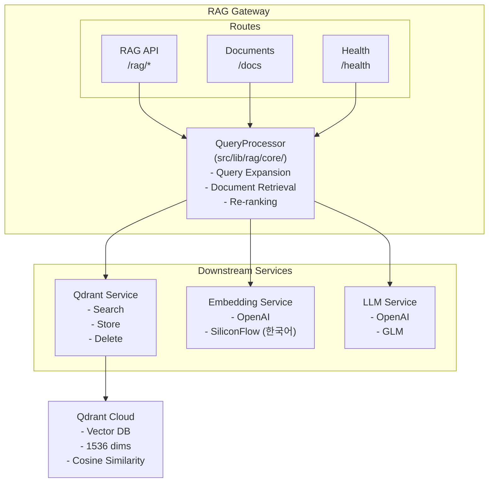

# RAG Gateway

RAG(Retrieval-Augmented Generation) 기반 블로그 검색 및 질의응답 API 서비스입니다. Qdrant 벡터 데이터베이스와 다양한 LLM을 활용하여 의미론적 검색과 컨텍스트 인식형 응답을 제공합니다.

## 프로젝트 개요 (Project Overview)

RAG Gateway는 DEV_BBAK 블로그의 콘텐츠를 지능적으로 검색하고 질문에 답변하기 위한 중앙 API 서비스입니다.

**핵심 특징:**

- 다중 LLM 지원 (OpenAI GPT-4o-mini, GLM-4.6)
- Qdrant 벡터 데이터베이스를 활용한 의미론적 검색
- 다중 임베딩 모델 지원 (OpenAI, SiliconFlow 한국어)
- Query Expansion을 통한 검색 품질 개선
- Semantic Chunking을 통한 문맥 보존
- 타입 안전한 API 설계 (Zod + @hono/zod-validator)
- 전략 패턴 기반 LLM 서비스 아키텍처

**기술 스택:**

- **Web Framework**: Hono 4.11.1 + @hono/node-server 1.19.7
- **Validation**: Zod 3.25.76 + @hono/zod-validator 0.7.6
- **LLM**: OpenAI GPT-4o-mini, GLM-4.6
- **Embedding**: OpenAI text-embedding-3-small, SiliconFlow BAAI/bge-m3
- **Vector DB**: Qdrant 1.13.0 (@qdrant/js-client-rest)
- **Environment**: @t3-oss/env-nextjs (타입 안전한 환경 변수)
- **Language**: TypeScript 5.7.2

## 주요 기능 (Key Features)

### 1. RAG 질의응답 (`POST /api/rag/query`)

사용자 질문과 관련된 블로그 콘텐츠를 검색하고 LLM을 활용하여 컨텍스트 인식형 답변을 생성합니다.

**특징:**

- 의미론적 벡터 검색 (상위 K개 문서)
- Query Expansion (질문 확장을 통한 검색 범위 개선)
- Document Grouping (청크를 문서 단위로 그룹화)
- LLM 기반 자연어 응답 생성
- 쿼리 의도 자동 분류 (search, explain, how_to, troubleshoot 등)

### 2. 문서 검색 (`POST /api/rag/search`)

LLM 응답 없이 순수 의미론적 검색만 수행합니다.

**특징:**

- 벡터 유사도 기반 검색
- Re-ranking 지원
- 필터링 (category, tags, author, source)
- 관련성 점수 반환

### 3. 문서 관리 (`/api/documents`)

블로그 콘텐츠의 CRUD 및 인덱싱를 제공합니다.

**기능:**

- 문서 목록 조회 (페이지네이션, 검색, 필터링)
- 문서 추가 (자동 청킹 + 임베딩)
- 문서 재인덱싱 (내용 변경 시)
- 문서 삭제
- 청크 단위 조회

### 4. 인제스트 모니터링 (`/monitoring/*`)

문서 인덱싱 작업의 상태를 모니터링하고 알림을 받을 수 있습니다.

**기능:**

- 실시간 진행률 추적
- 작업 통계 조회
- Slack/이메일 알림 (완료/실패 시)

**API 엔드포인트:**

- `POST /rag/ingest` - 인제스트 시작
- `GET /rag/ingest/status?jobId={id}` - 작업 상태 조회
- `GET /monitoring/jobs` - 모든 작업 목록
- `GET /monitoring/stats` - 통계 요약
- `GET /monitoring/current` - 현재 실행 중인 작업
- `GET /monitoring/jobs/:id` - 특정 작업 조회

## 아키텍처 (Architecture)



## 디렉토리 구조

```
apps/rag-gateway/
├── docs/                     # 문서
│   ├── RAG_ARCHITECTURE.md   # 아키텍처 설명
│   └── API.md                # API 문서
├── scripts/
│   └── ingest-claude-docs.ts # 문서 인덱싱 스크립트
├── src/
│   ├── env.ts                # 환경 변수 (t3-oss/env-nextjs)
│   ├── index.ts              # 서버 진입점
│   ├── routes/
│   │   ├── rag/
│   │   │   └── index.ts      # RAG API
│   │   └── documents/
│   │       └── index.ts      # 문서 관리 API
│   └── services/
│       ├── qdrant.ts         # Qdrant 클라이언트
│       ├── embedding.ts      # 임베딩 서비스
│       └── llm/              # LLM 서비스 (Strategy Pattern)
│           ├── factory.ts
│           ├── index.ts
│           ├── openai.strategy.ts
│           ├── glm.strategy.ts
│           └── prompt.ts
└── package.json
```

## 환경 변수 설정

### 필수 환경 변수

```bash
# 서버
PORT=3002

# Qdrant
QDRANT_URL=https://your-cluster.qdrant.io
QDRANT_API_KEY=your-api-key

# LLM (하나 이상 필수)
OPENAI_API_KEY=sk-...
GLM_API_KEY=your-glm-key
LLM_PROVIDER=openai|glm
```

### 선택 환경 변수

```bash
# Embedding (기본값: OpenAI)
EMBEDDING_PROVIDER=openai|siliconflow
EMBEDDING_MODEL=text-embedding-3-small|BAAI/bge-m3
SILICONFLOW_API_KEY=sk-...

# 캐싱 (선택사항)
REDIS_URL=redis://localhost:6379

# CORS
ALLOWED_ORIGINS=http://localhost:3000,http://localhost:3001

# 알림 설정 (선택사항)
SLACK_WEBHOOK_URL=https://hooks.slack.com/services/YOUR/WEBHOOK/URL
SLACK_CHANNEL=#notifications
NOTIFICATION_EMAILS=user1@example.com,user2@example.com
RESEND_API_KEY=re_xxxxxxxxxxxxx

# Blog-Admin 연동
BLOG_ADMIN_URL=http://localhost:3001

# 클라이언트
NEXT_PUBLIC_RAG_URL=http://localhost:3002
```

### 한국어 임베딩 사용 설정

SiliconFlow의 BAAI/bge-m3 모델을 사용하여 한국어 검색 품질을 개선할 수 있습니다:

```bash
EMBEDDING_PROVIDER=siliconflow
EMBEDDING_MODEL=BAAI/bge-m3
SILICONFLOW_API_KEY=your-siliconflow-key
```

**주의**: 임베딩 모델에 따라 벡터 차원이 다릅니다. 모델 변경 시 Qdrant 컬렉션을 삭제하고 재생성해야 합니다.

## 시작하기 (Getting Started)

### 1. 사전 요구사항

- Node.js 20+
- pnpm 8+
- Qdrant 인스턴스 (로컬 또는 클라우드)

### 2. 설치

```bash
# 의존성 설치
pnpm install

# 워크스페이스 빌드
pnpm build
```

### 3. 실행

```bash
# 개발 모드
pnpm dev

# 프로덕션 빌드
pnpm build

# 프로덕션 실행
NODE_ENV=production pnpm start
```

서비스가 http://localhost:3002에서 시작됩니다.

## API 사용 예시

### RAG 질의응답

```bash
curl -X POST http://localhost:3002/api/rag/query \
  -H "Content-Type: application/json" \
  -d '{
    "query": "Vercel Blob CDC는 어떻게 작동하나요?",
    "limit": 5
  }'
```

**응답 예시:**

```json
{
  "answer": "Vercel Blob CDC는 Vercel Blob Storage에 저장된 파일을...",
  "sources": [
    {
      "id": "doc_123",
      "title": "env",
      "slug": "/blog/env",
      "content": "- **Purpose**: Vercel Blob CDC 동기화 간격...",
      "score": 0.76,
      "metadata": {
        "title": "env",
        "category": "facts/apps/blog-admin",
        "tags": [],
        "author": "claude-code"
      }
    }
  ],
  "usage": {
    "model": "glm-4.6",
    "totalTokens": 2528,
    "cost": 0.00005264
  },
  "queryTime": 43906
}
```

### 문서 검색

```bash
curl -X POST http://localhost:3002/api/rag/search \
  -H "Content-Type: application/json" \
  -d '{
    "query": "TypeScript 타입 추론",
    "limit": 10
  }'
```

### 문서 인덱싱

```bash
curl -X POST http://localhost:3002/api/documents \
  -H "Content-Type: application/json" \
  -d '{
    "content": "# 제목\n\n내용...",
    "metadata": {
      "title": "문서 제목",
      "slug": "/blog/post-slug",
      "category": "facts/tech",
      "tags": ["typescript", "types"],
      "author": "bbakjun"
    }
  }'
```

### 문서 목록 조회

```bash
curl "http://localhost:3002/api/documents?limit=20&category=facts"
```

## LLM 서비스 전략 패턴

LLMService는 전략 패턴(Strategy Pattern)으로 구현되어 여러 LLM 제공자를 쉽게 전환할 수 있습니다.

**지원 LLM:**

| 제공자 | 모델                | 용도                 |
| ------ | ------------------- | -------------------- |
| OpenAI | GPT-4o-mini         | 일반적인 영어/다국어 |
| GLM    | GLM-4.6, GL-4-flash | 한국어 특화          |

**전환 방법:**

```bash
# .env에서 설정
LLM_PROVIDER=openai|glm
```

## 임베딩 서비스

다중 임베딩 제공자를 지원하여 한국어 검색 품질을 최적화할 수 있습니다.

**지원 모델:**

| 제공자      | 모델                   | 차원 | 특징          |
| ----------- | ---------------------- | ---- | ------------- |
| OpenAI      | text-embedding-3-small | 1536 | 균형 임베딩   |
| OpenAI      | text-embedding-3-large | 3072 | 고성능        |
| SiliconFlow | BAAI/bge-m3            | 1024 | 다국어/한국어 |

**전환 방법:**

```bash
# .env에서 설정
EMBEDDING_PROVIDER=openai|siliconflow
EMBEDDING_MODEL=text-embedding-3-small|BAAI/bge-m3
```

## 청킹 전략

Semantic Chunker가 의미론적 경계를 유지하며 문서를 분할합니다.

**파라미터:**

- `maxSize`: 1200 (최대 청크 크기)
- `minSize`: 100 (최소 청크 크기)
- `overlap`: 200 (청크 간 오버랩)

**특징:**

- 헤딩, 코드 블록, 리스트 구조 유지
- 문장/문단 경계에서 분할
- 오버랩으로 문맥 연결성 보존

## 검색 품질 최적화

### 구현된 기법

1. **청킹 최적화**: 더 큰 청크와 높은 오버랩으로 문맥 보존
2. **Query Expansion**: 질문 확장으로 검색 범위 개선
3. **Document Grouping**: 청크를 문서 단위로 그룹화하여 정렬

### 점수 기준

- **Cosine Similarity**: 0.7 이상 권장
- **Re-ranking**: 점수 기반 재정렬
- **Threshold**: 0.5 (확장된 쿼리), 0.7 (일반 검색)

## 개발 명령어

```bash
# 개발 서버
pnpm dev

# 빌드
pnpm build

# 타입 체크
pnpm type-check

# 린트
pnpm lint

# 클린
pnpm clean
```

## 배포

### Vercel 배포

1. 환경 변수 설정
2. `pnpm build` 실행
3. Vercel에 배포

### Docker 배포 (예정)

```dockerfile
FROM node:20-alpine
WORKDIR /app
COPY package*.json ./
RUN pnpm install
RUN pnpm build
EXPOSE 3002
CMD ["pnpm", "start"]
```

## 라이선스

MIT

## 기여

이 프로젝트는 DEV_BBAK 블로그의 일부입니다. 개선 사항은 PR로 환영합니다!
