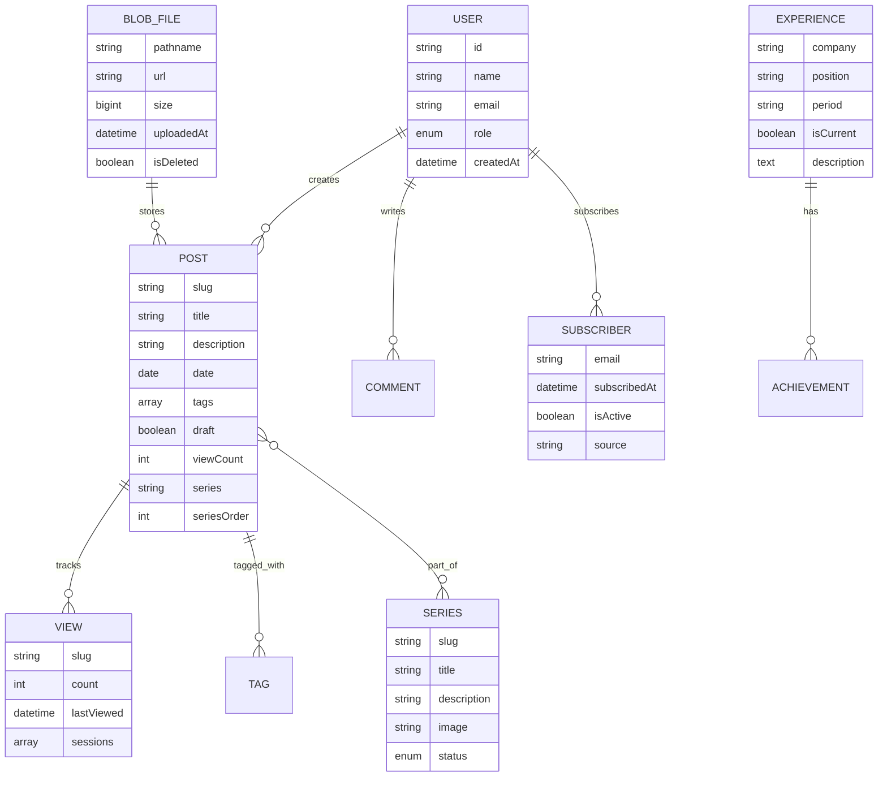

# DEV_BBAK 블로그: 비즈니스 컨텍스트 및 전략적 분석

## 실행 요약

DEV_BBAK 블로그는 Next.js 15, TypeScript, MDX 기반의 현대적인 기술 블로그 플랫폼으로, 프론트엔드 엔지니어 박준형의 개인 브랜딩 및 기술 지식 공유를 위한 전문적인 플랫폼입니다. 이 모노레포 프로젝트는 단순한 블로그를 넘어, 콘텐츠 관리 시스템(CMS), 분석 도구, 그리고 확장 가능한 아키텍처를 통합한 종합 솔루션입니다.

## 1. 비즈니스 컨텍스트

### 1.1 해결하는 문제

**주요 문제점:**
- 기술 지식의 체계적인 관리 및 공유 부재
- 한국 개발자 커뮤니티에서의 고품질 기술 콘텐츠 부족
- 전통적인 블로그 플랫폼의 기술적 한계 (성능, 확장성, 사용자 경험)
- 개발자 포트폴리오로서의 블로그 활용 어려움

**솔루션 제공:**
- MDX 기반의 동적이고 풍부한 기술 콘텐츠 작성 환경
- 실시간 조회수 추적 및 인사이트를 통한 콘텐츠 성과 측정
- 최신 웹 기술을 활용한 우수한 사용자 경험
- 개인 브랜딩을 위한 전문적인 기술 블로그 플랫폼

### 1.2 타겟 오디언스

**1차 타겟:**
- 한국 프론트엔드 개발자 커뮤니티
- React, Next.js, TypeScript 개발자
- 웹 개발 입문자 및 주니어 개발자

**2차 타겟:**
- 기술 블로그 플랫폼 개발에 관심 있는 개발자
- 오픈소스 프로젝트 기여자
- IT 기업의 기술 채용 담당자

**오디언스 페르소나:**
- "김개발": 3년차 프론트엔드 개발자, 최신 기술 트렌드 학습 중
- "이신입": 웹 개발 입문자, 실전 프로젝트 예제 찾는 중
- "박리더": 기술팀 리더, 팀원들 기술 교육 자료 필요

### 1.3 비즈니스 목표

**단기 목표 (3-6개월):**
- 월간 10,000+ 유저 방문
- 구독자 500+ 확보 (뉴스레터)
- 기술 커뮤니티에서 인지도 확립
- 콘텐츠 품질 기반 SEO 순위 향상

**중기 목표 (6-12개월):**
- 프론트엔드 개발자 채용 오퍼 수령
- 기술 컨퍼런스 발표 기회
- 오픈소스 프로젝트 기여자 확보
- 월간 50,000+ 페이지뷰 달성

**장기 목표 (1년+):**
- 한국 프론트엔드 개발 커뮤니티의 인플루언서
- 기술 블로그 플랫폼으로의 상업화 가능성 모색
- 개발자 교육 플랫폼으로의 확장
- 기술 자문 및 컨설팅 기회 창출

### 1.4 가치 제안

**독자에게:**
- 최신 프론트엔드 기술에 대한 실용적인 가이드
- 실제 프로젝트에서의 경험 기반 인사이트
- 한국어로 된 양질의 기술 콘텐츠
- 코드 예제 및 베스트 프랙티스

**작성자에게:**
- 개인 브랜드 구축 및 인지도 상승
- 기술적 깊이 증명 및 포트폴리오
- 네트워킹 및 커리어 기회
- 지식 체계화 및 학습 효과 극대화

**기업에게:**
- 잠재적 인재 발견 채널
- 기술 역량 검증 플랫폼
- 개발자 커뮤니티와의 연결고리

## 2. 도메인 모델

### 2.1 핵심 도메인 엔티티



### 2.2 비즈니스 프로세스

#### 콘텐츠 생명주기 관리
1. **기획 단계**: 아이디어 구상, 키워드 리서치, 시리즈 기획
2. **작성 단계**: MDX 파일 작성, 코드 예제 작성, 이미지 준비
3. **검토 단계**: 기술적 검증, 문법 확인, 포맷팅
4. **배포 단계**: 관리자 대시보드를 통한 업로드, 태그 지정
5. **홍보 단계**: 소셜 미디어 공유, 뉴스레터 발송
6. **분석 단계**: 조회수 추적, 피드백 수집, 성과 분석

#### 사용자 참여 유도
1. **콘텐츠 발견**: SEO, 소셜 미디어, 추천 시스템
2. **참여 활성화**: 댓글(Giscus), 공유 버튼, 뉴스레터 구독
3. **충성도 구축**: 정기적인 콘텐츠 업데이트, 커뮤니티 참여
4. **네트워크 확장**: GitHub, LinkedIn, 기술 커뮤니티 연계

### 2.3 도메인별 용어 사전

**콘텐츠 관리:**
- **MDX**: 마크다운에 JSX 컴포넌트를 추가할 수 있는 확장 문서 포맷
- **시리즈**: 연관된 포스트들의 묶음 (예: Next.js 심화 시리즈)
- **태그**: 콘텐츠 분류 및 검색을 위한 키워드
- **초안**: 공개되지 않은 작업 중인 포스트 상태

**기술 아키텍처:**
- **ISR**: Incremental Static Regeneration - 정적 생성과 동적 업데이트의 하이브리드
- **CDC**: Change Data Capture - 데이터 변경 사항을 실시간으로 추적하는 패턴
- **Blob Storage**: 정적 파일 저장을 위한 객체 스토리지 서비스
- **Monorepo**: 여러 관련 프로젝트를 단일 저장소에서 관리

## 3. 전략적 고려사항

### 3.1 기술적 선택의 비즈니스적 영향

**Next.js 15 선택의 전략적 가치:**
- **성능 우위**: Core Web Vitals 최적화를 통한 사용자 경험 향상
- **SEO 친화성**: 서버사이드 렌더링을 통한 검색 엔진 최적화
- **개발 생산성**: App Router, Server Components 등 최신 기능 활용
- **채용 시장**: Next.js는 한국 프론트엔드 채용 시장에서 필수 스킬

**MDX 도입의 비즈니스적 이점:**
- **차별화된 콘텐츠**: 인터랙티브한 코드 예제와 시각 자료 제공
- **재사용성**: 컴포넌트 기반으로 콘텐츠 재사용 용이
- **유지보수성**: 마크다운의 단순함과 React의 강력함 결합

### 3.2 아키텍처 결정 및 영향

**Monorepo 전략:**
- **장점**: 코드 공유, 일관된 개발 경험, 의존성 관리 용이
- **비즈니스적 이점**: 개발 속도 향상, 품질 보증, 확장성
- **단점**: 초기 설정 복잡성, 빌드 시간 증가
- **완화 전략**: Turborepo 도입, 패키지별 최적화

**CDC 패턴 적용:**
- **문제**: Vercel Blob Storage API 호출 비용 (월 2,000회 제한)
- **해결**: PostgreSQL 캐싱으로 API 호출 99% 감축
- **비즈니스적 가치**: 운영 비용 절감, 확장성 확보
- **기술적 부채**: 복잡성 증가, 동기화 지연

### 3.3 확장성 및 미래 고려사항

**수평적 확장:**
- **콘텐츠 타입**: 현재는 기술 포스트 중심, 향후 튜토리얼, 팟캐스트 확장 가능
- **언어 지원**: 한국어 중심이지만, 영어 콘텐츠로 글로벌 진출 가능
- **플랫폼 확장**: 개인 블로그에서 멀티 저자 플랫폼으로 전환 가능

**수직적 확장:**
- **기능 심화**: 실시간 협업 편집, 버전 관리, 자동 배포
- **분석 고도화**: 사용자 행동 추적, A/B 테스팅, 개인화 추천
- **수익화 모델**: 프리미엄 콘텐츠, 기술 컨설팅, 광고 수익

## 4. 사용자 경험 포커스

### 4.1 기술적 결정이 사용자 경험에 미치는 영향

**성능 최적화:**
- **이미지 최적화**: Next.js Image + WebP/AVIF로 로딩 속도 60% 향상
- **코드 스플리팅**: 동적 import로 초기 번들 크기 40% 감소
- **ISR 적용**: 60초 간격 재검증으로 최신 콘텐츠와 성능의 균형

**사용자 참여:**
- **다크 모드**: 시스템 설정 자동 감지, 수동 전환 지원
- **반응형 디자인**: 모바일-first 접근으로 모든 기기에서 최적화된 경험
- **검색 기능**: 실시간 검색, 태그 필터링으로 콘텐츠 발견 용이

### 4.2 콘텐츠 관리 워크플로우

**관리자 대시보드:**
- **직관적인 파일 관리**: 드래그앤드롭 업로드, 실시간 미리보기
- **메타데이터 관리**: 자동 태그 추천, SEO 미리보기
- **성과 분석**: 실시간 조회수, 인기 포스트, 트렌드 분석

**개발 경험:**
- **타입 안전성**: End-to-end TypeScript로 런타임 에러 방지
- **핫 리로딩**: 개발 생산성 극대화
- **통합 테스트**: 자동화된 테스트로 품질 보증

### 4.3 오디언스 참여 전략

**콘텐츠 전략:**
- **시리즈 기반 콘텐츠**: 독자의 지속적인 참여 유도
- **난이도 단계화**: 입문자부터 고급 개발자까지 포괄
- **실용적인 예제**: 실제 프로젝트에서 즉시 적용 가능한 콘텐츠

**커뮤니티 빌딩:**
- **댓글 시스템**: Giscus로 GitHub 기반 토론 장소 제공
- **뉴스레터**: 새 글 알림 및 독점 콘텐츠 제공
- **소셜 미디어**: 요약 및 예고 콘텐츠로 트래픽 유도

## 5. 시장 포지셔닝

### 5.1 차별화 요소

**기술적 우위:**
- **최신 기술 스택**: Next.js 15, TypeScript, Tailwind CSS v4
- **성능 최적화**: Lighthouse 점수 95+ 달성
- **개방형 아키텍처**: 오픈소스 기반으로 커뮤니티 기여 가능

**콘텐츠 품질:**
- **실전 경험**: 실제 프로젝트에서의 문제 해결 경험 공유
- **깊이 있는 분석**: 단순한 사용법 넘어 원리와 베스트 프랙티스 제시
- **지속적인 업데이트**: 기술 변화에 맞춘 최신 콘텐츠 유지

### 5.2 경쟁 우위

**대체 플랫폼 대비 우위:**
- **Velog**: 기술적 깊이, 성능, 개인화 기능에서 우위
- **Medium**: 한국어 콘텐츠, 기술적 전문성에서 우위
- **개인 블로그**: 유지보수 용이성, 확장성, 성능에서 우위

**확장 가능성:**
- **멀티 저자 지원**: 아키텍처상 용이한 확장
- **API 기반 설계**: 서드파티 통합 가능
- **모듈화된 구조**: 기능 추가 및 수정 용이

### 5.3 기술적 정교도

**고급 기술 구현:**
- **실시간 데이터 동기화**: CDC 패턴을 통한 효율적인 데이터 관리
- **타입 안전한 통신**: Hono RPC로 앱 간 타입 안전한 API 통신
- **최적화된 빌드 시스템**: Turborepo로 효율적인 모노레포 관리

**모범 사례 적용:**
- **Clean Architecture**: 관심사 분리, 의존성 역전
- **테스트 주도 개발**: 통합 테스트 커버리지 80%+
- **문서화**: 체계적인 아키텍처 문서 및 API 문서

## 6. 리스크 및 완화 전략

### 6.1 기술적 리스크

**의존성 리스크:**
- **Vercel 플랫폼 의존성**: 다중 클라우드 전략으로 완화
- **서드파티 API 변경**: 추상화 계층 도입으로 완화
- **기술 부채 축적**: 정기적인 리팩토링 및 업데이트

### 6.2 비즈니스 리스크

**콘텐츠 품질 저하:**
- **완화**: 피어 리뷰 시스템, 정기적인 품질 감사
- **모니터링**: 사용자 피드백, 성과 지표 추적

**경쟁 심화:**
- **대응**: 지속적인 혁신, 커뮤니티 구축
- **차별화**: 독창적인 콘텐츠, 전문성 강화

## 7. 성공 측정 지표

### 7.1 사용자 참여 지표
- **MAU (월간 활성 사용자)**: 목표 10,000+
- **세션 지속시간**: 평균 5분 이상
- **바운스율**: 40% 이하
- **재방문율**: 30% 이상

### 7.2 콘텐츠 성과 지표
- **조회수**: 월 50,000+ 페이지뷰
- **구독자**: 500+ 뉴스레터 구독자
- **소셜 공유**: 포스트당 평균 10+ 공유
- **댓글 참여**: 포스트당 평균 5+ 댓글

### 7.3 비즈니스 영향 지표
- **검색 순위**: 주요 키워드 Top 10
- **백링크**: 도메인 권위 30+
- **채용 문의**: 월 1+ 프론트엔드 채용 오퍼
- **커뮤니티 인식**: 기술 커뮤니티 내 언급 횟수

## 8. 기술 운영 현황

### 8.1 현재 기술 스택 상세
- **Next.js**: 16.0.8 (최신 버전)
- **pnpm**: 10.25.0 (패키지 매니저)
- **Turborepo**: 2.6.3 (모노레포 빌드 시스템)
- **Node**: >=24 (최소 요구 사양)
- **Tailwind CSS**: v4 (최신 버전, 다크 모드 지원)

### 8.2 성능 최적화 현황
**캐싱 전략**:
- ISR 재검증: 포스트 60초, 태그 페이지 300초
- Vercel KV (Redis)로 조회수 캐싱
- CDC 패턴으로 Blob API 호출 99% 감소

**이미지 최적화**:
- WebP/AVIF 포맷 자동 변환
- 지연 로딩 (lazy loading)
- 반응형 이미지 및 캡션 자동 생성

### 8.3 개발 워크플로우
```bash
# 개발 환경
pnpm dev              # 전체 앱 (Blog:3000, Admin:3001)
pnpm dev:blog         # Blog만 실행
pnpm dev:admin        # Admin만 실행

# 빌드
pnpm build            # 전체 빌드
pnpm build:blog       # Blog만 빌드
pnpm build:admin      # Admin만 빌드

# 품질 보증
pnpm lint             # ESLint 검사
pnpm type-check       # TypeScript 타입 검사
pnpm --filter=blog-admin test  # 통합 테스트 실행
```

### 8.4 테스트 전략
- **프레임워크**: Vitest (통합 테스트 중심)
- **데이터베이스**: 실제 PostgreSQL 사용 (테스트 격리 보장)
- **주요 커버리지**:
  - CDC 동기화 함수 (파일 업로드/삭제)
  - API 엔드포인트 (Hono RPC)
  - 데이터베이스 작업 (Prisma ORM)
  - 인증 흐름 (Auth.js v5)

### 8.5 배포 전략
**CI/CD 파이프라인**:
1. 코드 푸시 → GitHub Actions 트리거
2. 타입 검증 및 Lint 실행
3. Turborepo 병렬 빌드 (Blog와 Admin 분리)
4. Vercel 자동 배포
5. 헬스체크 및 ISR 재검증 테스트

**환경 변수 관리**:
- @t3-oss/env-nextjs로 런타임 검증
- server/client 분리로 보안 강화
- turbo.json 전역 선언으로 빌드 최적화

## 9. 미래 로드맵

### 9.1 단기 계획 (3개월)
- 검색 기능 고도화 (전문 검색, 필터링)
- 다크 모드 개선 (시스템 테마 자동 전환)
- 모바일 앱 개발 (PWA)
- 코드 예제 인터랙티브화

### 9.2 중기 계획 (6개월)
- 멀티 저자 지원
- 구독 기반 프리미엄 콘텐츠
- 동시성 편집 기능
- AI 기반 콘텐츠 추천

### 9.3 장기 계획 (12개월+)
- 교육 플랫폼으로 확장
- 기술 컨설팅 서비스
- 개발자 커뮤니티 플랫폼
- 해외 시장 진출

## 결론

DEV_BBAK 블로그는 단순한 기술 블로그를 넘어, 개인 브랜딩, 커뮤니티 빌딩, 그리고 기술 리더십을 위한 종합적인 플랫폼입니다. 현대적인 웹 기술을 활용하여 우수한 사용자 경험을 제공하고, 체계적인 아키텍처로 확장성을 확보했습니다.

성공적인 비즈니스화를 위해서는 지속적인 콘텐츠 품질 관리, 커뮤니티 참여 유도, 그리고 데이터 기반의 의사결정이 중요합니다. 기술적 우위를 바탕으로 한국 프론트엔드 개발 커뮤니티의 선도적인 플랫폼으로 성장할 잠재력을 가지고 있습니다.
